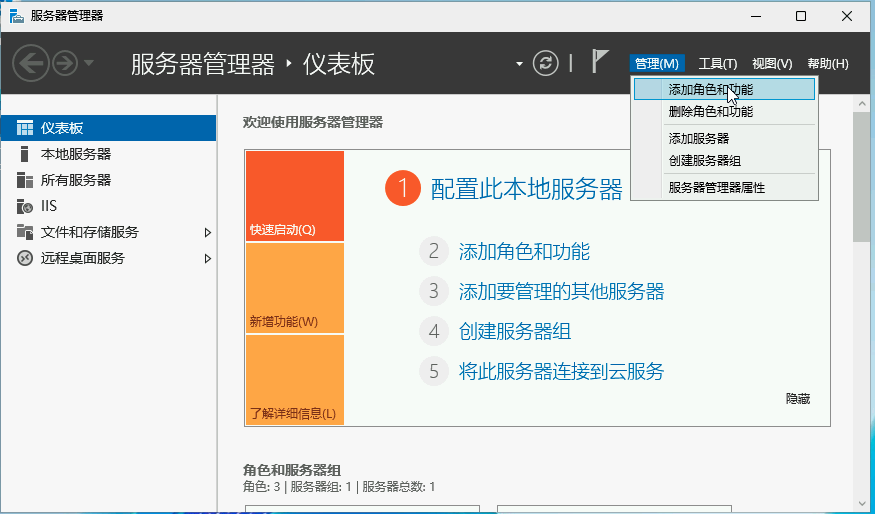
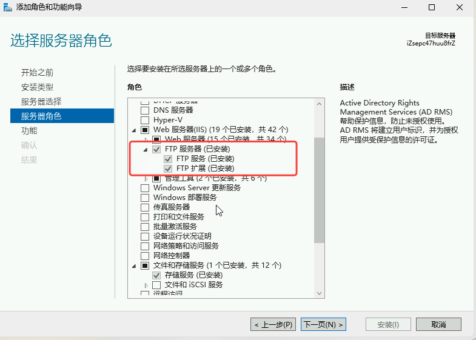
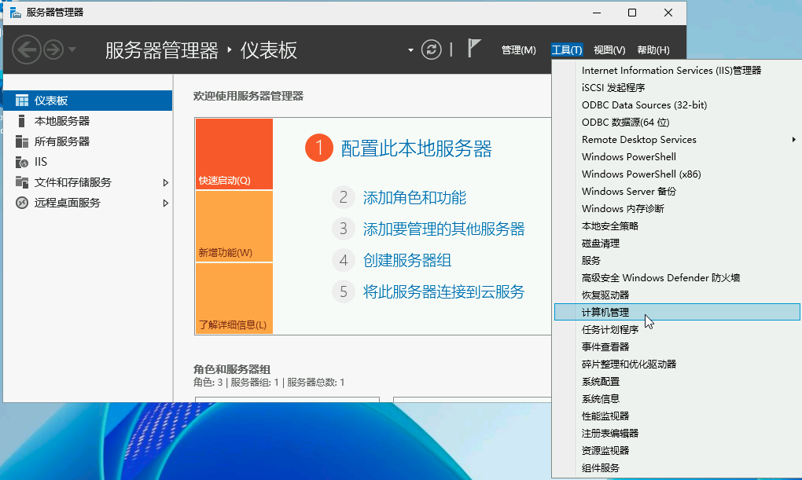
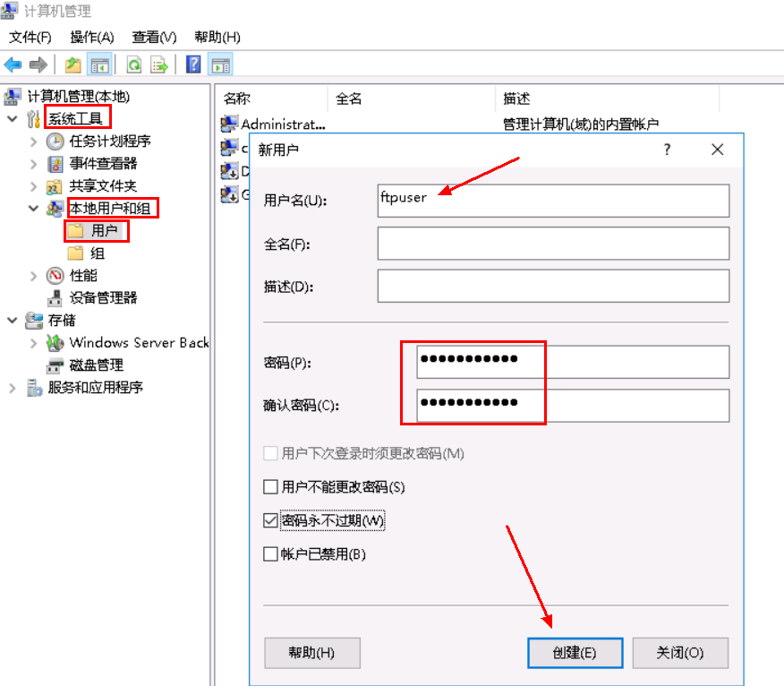
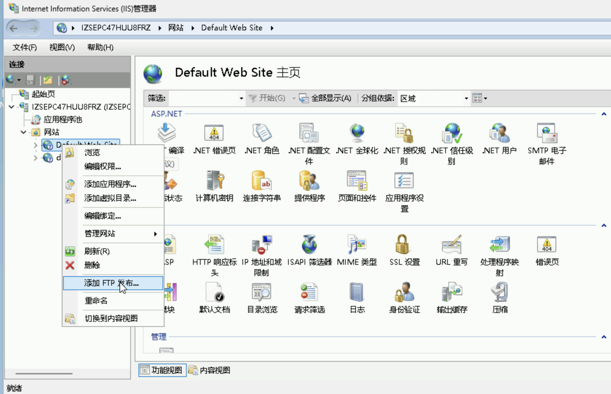
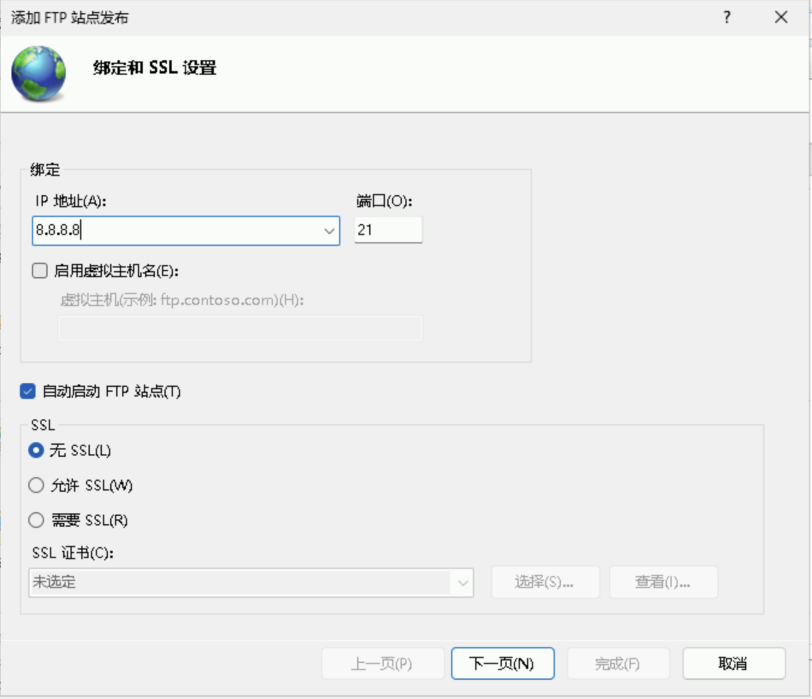
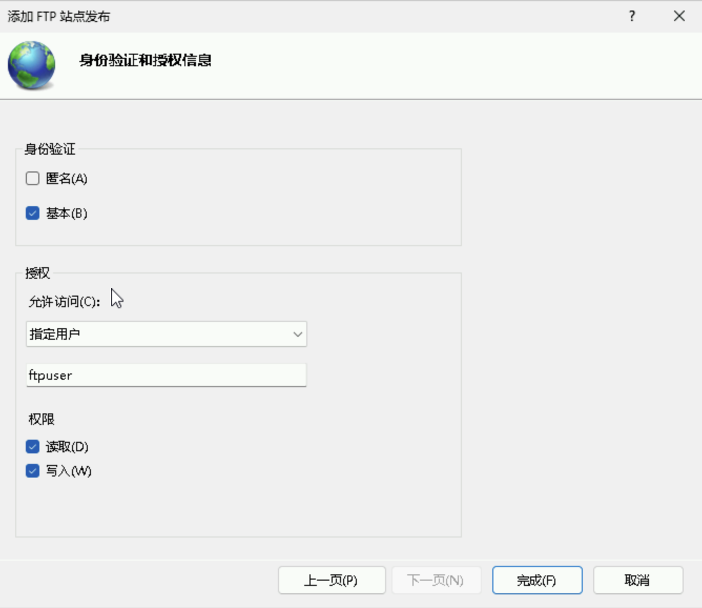
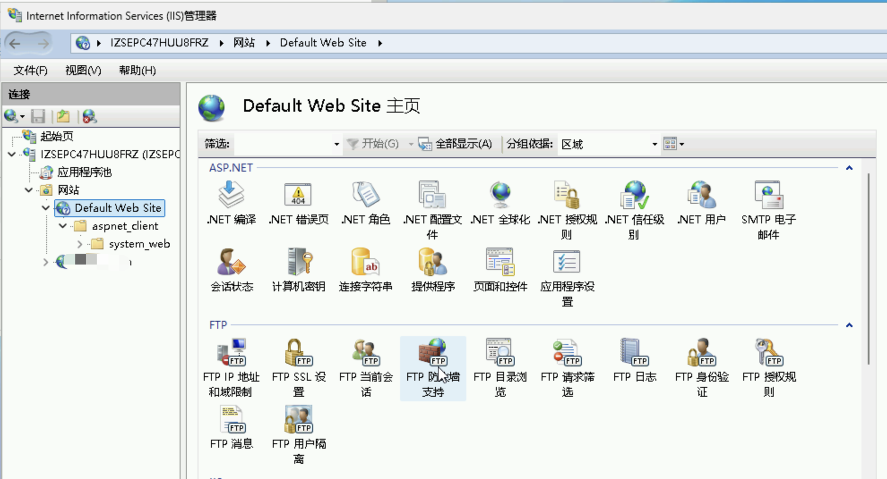
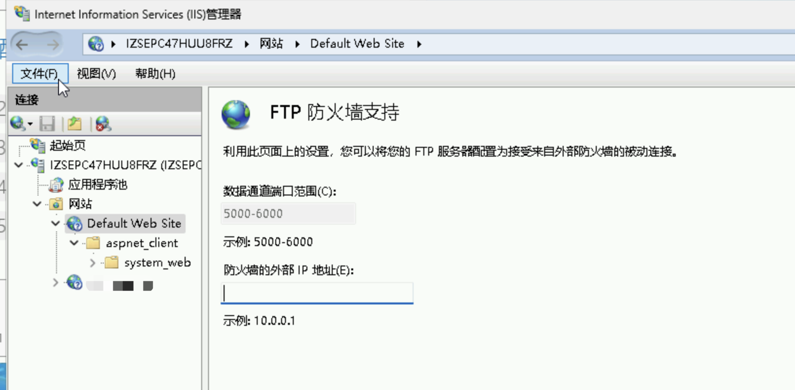

## 概述

FTP 服务是和 IIS Web 服务独立的，首先需要安装 FTP 服务，然后添加相关账号，创建需要发布的目录，最终则是配置 FTP 的端口等信息。

## 安装 FTP 服务

打开"服务器管理器"，选择“添加角色和功能”，

在“服务器角色”中，找到 FTP 服务器，勾选 FTP 服务，进行安装。

## 添加 FTP 账号

回到“服务器管理器”，在工具中打开 “计算机管理”

找到系统工具/本地用户和组，右键“用户”，添加一个新用户，如用户名为 “ftpuser”，设置密码，勾选“密码永不过期”，

## 发布 FTP 目录

打开 IIS，在网站右键菜单中，找到 “添加 FTP 发布”，

IP 地址为服务器的公网 IP 地址，端口默认使用 21，这里面选择无SSL，

点击下一步，身份验证选择“基本”，在授权一栏，选择“指定用户”访问，在下方输入前面创建FTP账号的用户名，也就是 “ftpuser”，权限为“读取，写入”，点击完成。

## 网络配置

在 IIS 中点击发布的网站，选择“FTP 防火墙支持”，

输入数据通道端口范围，这里输入建议值 5000-6000, 防火墙的外部 IP 地址，输入服务器的公网 IP 地址，点击完成。

在 IIS 配置完成后，我们还需要在 ECS 安全组中配置网络策略，首先 21 端口需要开启，其他上面添加的 5000-6000 端口也需要启动。

配置通过后，可使用 telnet 验证端口联通性。

> 这里面需要注意，21 是控制端口，5000-6000 是数据通道端口，都需要在安全组放行，否则 FTP 客户端无法正常连接使用。

## 参考资料

- [轻松配置FTP服务，Windows Server全版本通用教程](https://blog.csdn.net/ongwu/article/details/130817541)
- [windows开启IIS服务，配置FTP服务器](https://blog.csdn.net/ever_peng/article/details/120350838)
- [Windows Server 2019 搭建FTP站点](https://www.cnblogs.com/wencg/p/13450938.html)
- [WINDOWS Server 2012R2 搭建FTP服务器](https://www.cnblogs.com/KeepHoist/p/14103384.html)