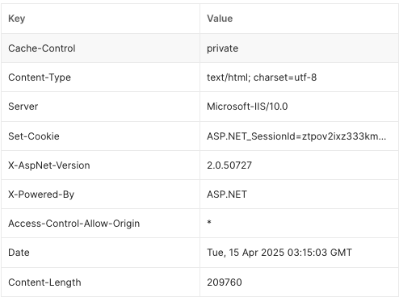
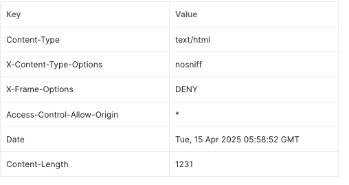
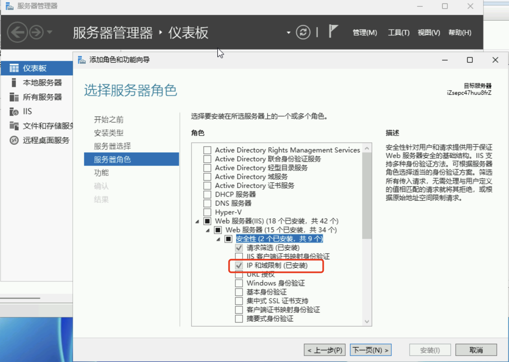
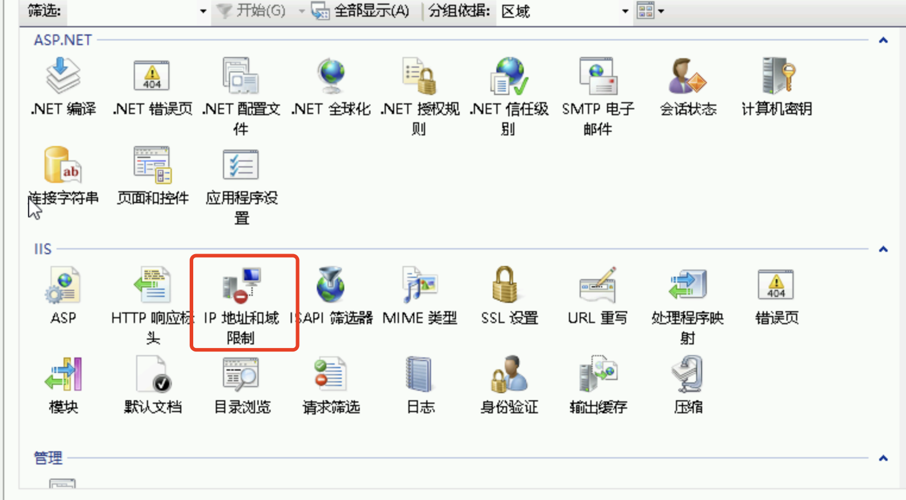
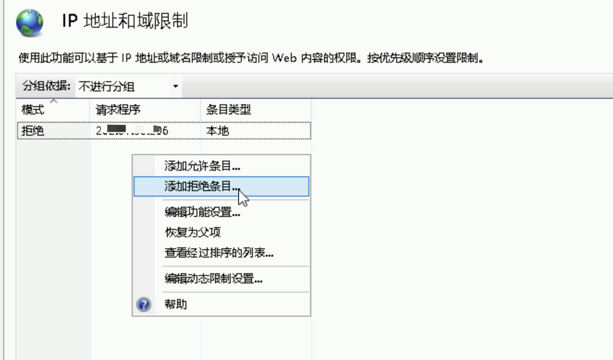

## Microsoft IIS 版本信息泄露

查看网页返回的 Header 信息，默认会包含 IIS，ASP.NET 版本信息：



### 隐藏 Server 标头


编辑 web.config 文件，在 system.webServer 节点中配置 requestFiltering 来移除Server标头：：

```diff
<security>
+  <requestFiltering removeServerHeader ="true" />
</security>
```

### 隐藏 X-ASPNET-Version 标头

编辑 web.config 文件，在 system.web 节点， 添加以下配置代码：

```diff
<system.web>
+  <httpRuntime enableVersionHeader="false" />
</system.web>
```

### 隐藏 X-Powered-By 标头

编辑 web.config 文件，在 system.webServer.customeHeaders 节点， 添加以下代码：

```diff
<system.webServer>
  <httpProtocol>
    <customHeaders>
+	    <remove name="X-Powered-By" />
    </customHeaders>
  </httpProtocol>
 </system.webServer>
```

修改完响应 Header 如下所示：



## 未加密的__VIEWSTATE参数

编辑 web.config 文件，在 system.web 节点， 添加以下配置代码：

```diff
	<system.web>
+		<pages enableEventValidation="true" validateRequest="false" viewStateEncryptionMode="Always" enableViewStateMac="true">
  </system.web>
```

以上配置加密__VIEWSTATE 参数，并启用__EVENTVALIDATION；


## HTML FORM 表单没有CSRF防护

通过全局向 <form> 注入隐藏域 CSRF 标签，即 <input type='hidden' name='CSRFToken' />, 服务端收到请求时，会验证 CSRFToken 是否正确，不正确则拒绝请求。

添加 `App_code/CSRFInjectingFilter.cs`

```c#
using System;
using System.IO;
using System.Text;
using System.Text.RegularExpressions;
using System.Web;

public class CSRFInjectingFilter : Stream
{
    private Stream _responseStream;
    private StringBuilder _buffer = new StringBuilder();
    private string _csrfToken;

    public CSRFInjectingFilter(Stream responseStream, string csrfToken) {
      _responseStream = responseStream;
      _csrfToken = csrfToken;
    }

    public override void Write(byte[] buffer, int offset, int count) {
      string content = Encoding.UTF8.GetString(buffer, offset, count);
      content = InjectToken(content);
      byte[] outData = Encoding.UTF8.GetBytes(content);
      _responseStream.Write(outData, 0, outData.Length);
    }

    private string InjectToken(string html) {
      string hiddenInput = string.Format("<input type='hidden' name='CSRFToken' value='{0}' />", _csrfToken);
	    return Regex.Replace(html, @"<form[^>]*>", match => match.Value + hiddenInput, RegexOptions.IgnoreCase);
    }

    // 其他 Stream 抽象成员实现
    public override bool CanRead { get { return false; } }
    public override bool CanSeek { get { return false; } }
    public override bool CanWrite { get { return true; } }
    public override void Flush() { _responseStream.Flush(); }

	public override long Length {
    get { throw new NotSupportedException(); }
	}

	public override long Position {
    get { throw new NotSupportedException(); }
    set { throw new NotSupportedException(); }
	}

	public override int Read(byte[] buffer, int offset, int count) { throw new NotSupportedException();}
	public override long Seek(long offset, SeekOrigin origin) { throw new NotSupportedException(); }
	public override void SetLength(long value) { throw new NotSupportedException();}

}
```

添加 `App_code/CSRFModule.cs`

```c#
using System;
using System.IO;
using System.Text;
using System.Text.RegularExpressions;
using System.Web;

public class CSRFModule : IHttpModule
{
    public void Init(HttpApplication context) {
        context.AcquireRequestState += OnAcquireRequestState;
        context.PreRequestHandlerExecute += OnPreRequestHandlerExecute;
    }

    private void OnAcquireRequestState(object sender, EventArgs e) {
        var app = (HttpApplication)sender;
        var context = app.Context;
        // 对 POST 请求做校验
        if (context.Request.HttpMethod == "POST" && context.CurrentHandler is System.Web.UI.Page) {
            string tokenFromForm = context.Request.Form["CSRFToken"];
	    	    string tokenFromSession = null;
          if (context.Session != null) {
            tokenFromSession = context.Session["CSRFToken"] as string;
          }

          if (string.IsNullOrEmpty(tokenFromForm) || tokenFromForm != tokenFromSession) {
            context.Response.StatusCode = 403;
            context.Response.Write("CSRF 验证失败");
            context.Response.End();
          }
        }
    }

    private void OnPreRequestHandlerExecute(object sender, EventArgs e)
    {
        var app = (HttpApplication)sender;
        var context = app.Context;

        // 只处理 text/html 类型响应
        if (context.CurrentHandler is System.Web.UI.Page && context.Response.ContentType == "text/html") {
            if (context.Session["CSRFToken"] == null) {
                context.Session["CSRFToken"] = Guid.NewGuid().ToString();
            }
            context.Response.Filter = new CSRFInjectingFilter(context.Response.Filter, context.Session["CSRFToken"].ToString());
        }
    }

    public void Dispose() { }
}

```

配置 web.config , 添加以下配置

在 system.web/httpModules 节点中添加 CSRFModule

```diff
<system.web>
  <httpModules>
+			<add name="CSRFModule" type="CSRFModule" />
```

在 system.webServer/modules 节点中添加 CSRFModule

```diff
<system.webServer>
		<modules>
+			<add name="CSRFModule" type="CSRFModule" />
```

## 其他

### 增加 IP 地址黑名单

首先打开“服务器管理器”中，进入“管理”，点击“添加角色和功能”，在“服务器角色”的 Web服务器/Web服务器/安全性 中找到 “IP和域限制”，勾选并安装。



安装成功后，在 IIS 中点击对应的网站，右侧面板中找到 “IP和域限制”，



双击进入，右键添加拒绝条目即可。

