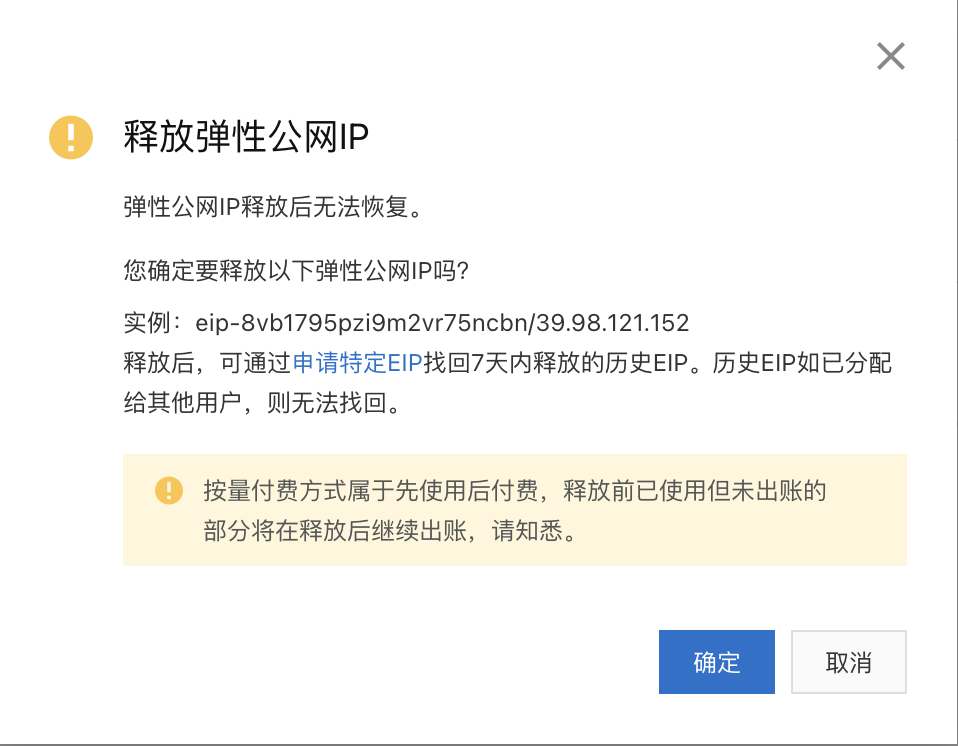
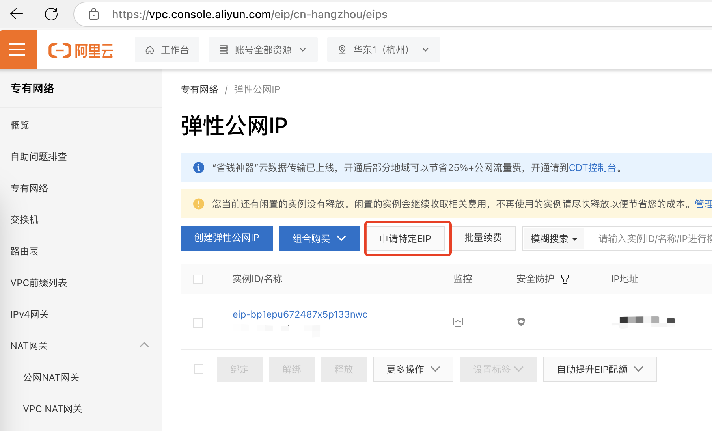
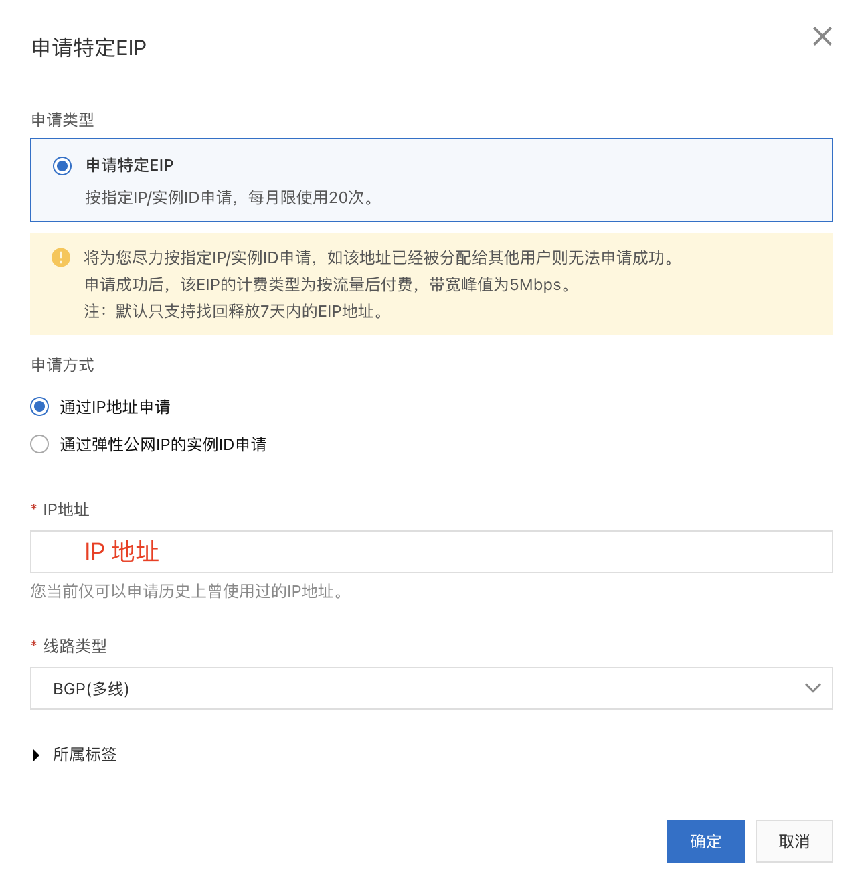

## 普通过户

如资料[过户按量付费EIP](https://help.aliyun.com/zh/eip/transfer-pay-as-you-go-eip)所述，如果原账号是个人账号，则目标账号无限制，如果原账号是企业账号，则目标账号必须为相同认证主体的企业账号。

其主要操作就是，在原账号发起过户，在新账号接收过户。具体请看参考资料，这种场景不是本文讨论的重点。

## 企业跨认证主体迁移

### 整体流程

1. 首先在需要将原账号的 ID，添加白名单

联系阿里云售后，添加白名单，提交工单或者钉钉技术支持，将原账号ID添加白名单，这样释放的IP不会进入公共资源池。

2. 在原账号释放 IP

IP资源池会在每个整点刷新，我们选择在整点时间后，如 9:02-9:30, 释放原IP。注意在释放前，必须记好释放的 IP 地址，我们将在新账号申请时用到。

3. 新新账号申请指定EIP

立即在新账号处，选择申请指定EIP，输入原账号释放的IP，然后选择申请。这样IP就转移到新账号了。

注意在申请时，左上角的地域，要选择与原IP所属的相同地域。

> 注意，万一申请失败，可以回到原账号，用上面第 3 条相同的方式，通过申请特定EIP找回7天内释放的历史EIP。

## 参考资料

- [过户按量付费EIP](https://help.aliyun.com/zh/eip/transfer-pay-as-you-go-eip)