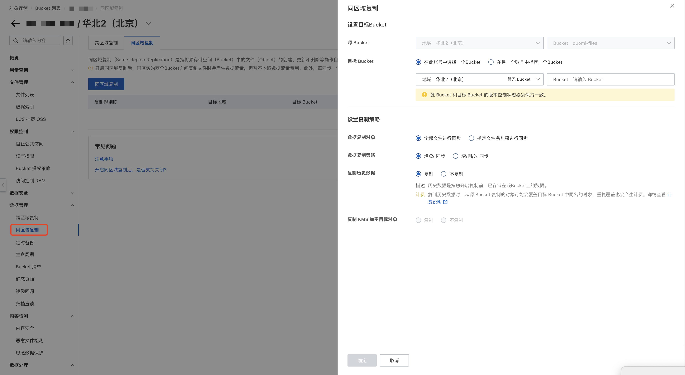
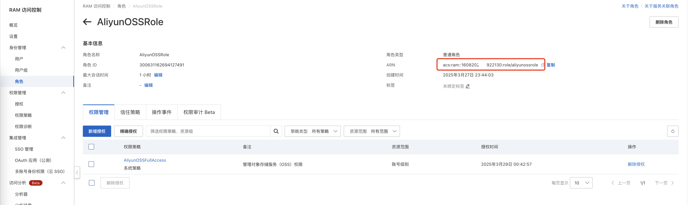
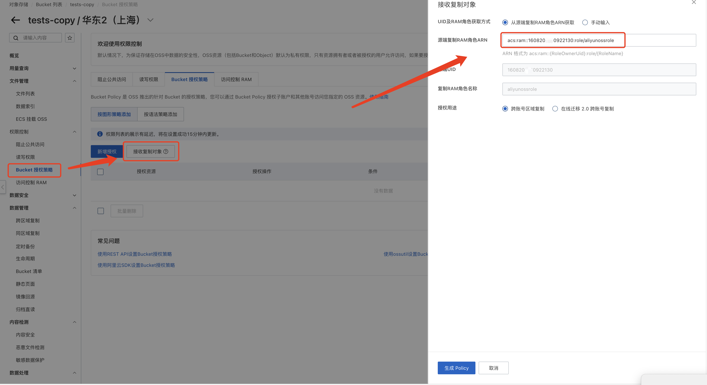
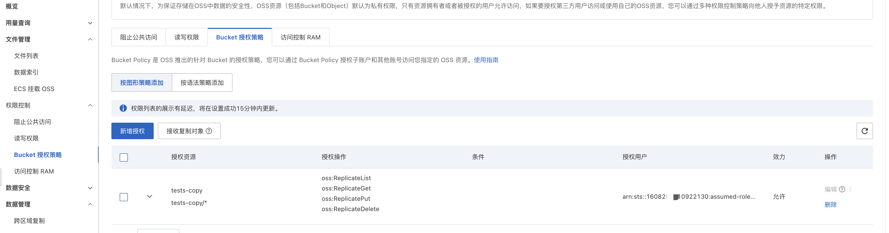
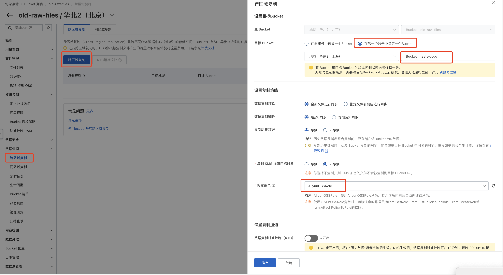
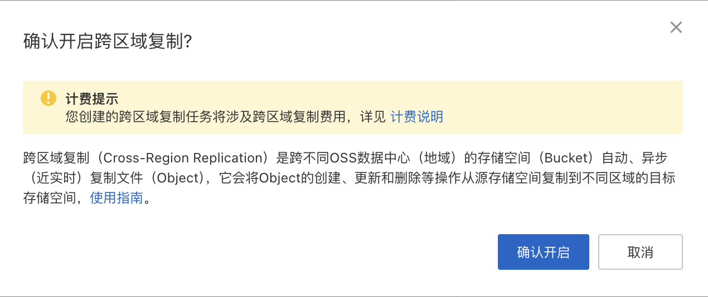
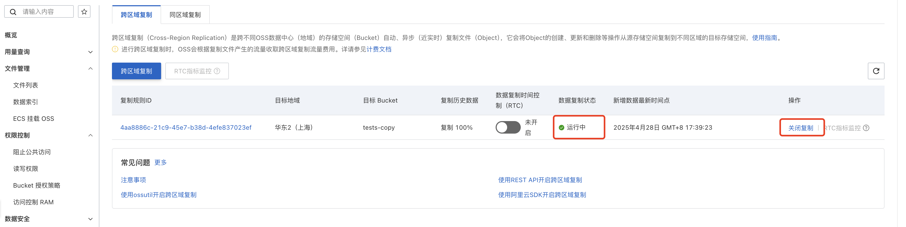

## 概述

Bucket 复制分为两种，同区域复制和跨区域复制

同账号复制比较简单，根据提示填写信息即可，本文主要介绍跨账号复制。

## 同区域复制

授权角色选择 “AliyunOSSRole”, 创建方法见 “跨区域复制”。然后点击确定即可。

## 跨区域复制

假设我们将原账号的 old-raw-files （华为2 北京）， 迁移至新账号的 tests-copy（华东2 上海）

### 在原账号配置授权角色 “AliyunOSSRole”

跨账号复制时，需要首先在原账号添加授权角色，打开 [RAM 访问控制/角色](https://ram.console.aliyun.com/roles/detail?roleName=AliyunOSSRole), 添加一个名为 AliyunOSSRole 的角色，增加授权 AliyunOSSFullAccess

添加成功后，在角色详情中，找到 ARM，点击复制，复制在内容将在后面新账号处用到。

### 在接收侧面配置授权

打开新账号中的目标 Bucket，进入管理界面，在左侧菜单栏中，依次找到 “文件管理/权限控制/Bucket授权策略”，点击“接收复制对象”，

在右侧弹窗中，使用默认配置 “从源端复制RAM角色ARN获取”，下方的 “源端复制RAM角色ARN”，粘贴前面复制好的 ARM，之后点击生成 Policy, 点击保存。

成功后显示如下：

### 开启复制

建议使用默认配置，即勾选 “全部文件进行同步”以及“增/改 同步”，“复制历史数据”。这意思是说，首次同步时会进行一次全量复制，之后会将增加/修改的文件，增量同步新的 Bucket。

点击“确定”，之后点击 “确认开启”，等待数据复制开启。

稍等片刻，可以看到状态为运行中。

等到 OSS 迁移完成之后，可以再关闭复制。

## 切换域名

1. 如果你的 Bucket 绑定了自定义域名，则在新的 Bucket 中，重新添加绑定的域名即可，绑定成功后，旧的 Bucket 处，自定义域名会自动失效。

2. 如果没有使用自定义域名，则需要批量更新数据库中存储的 oss 域名，或者考虑保留原来的 Bucket 名称，如 3 所述。

3. Bucket 的名称默认全国唯一，如果希望保留原来的名称，可以使用以下方式间接实现：

这里需要创建三个 Bucket，A(name-1) 数据迁移到 B(name-2)，删除 A，新建与 A 同名的 C(name-1), 再将 B 数据迁移到 C

## 其他

### CDN 切换

完成 Bucket 迁移后，在新账号重新绑定域名和配置 CDN，参考 [快速接入阿里云CDN](https://help.aliyun.com/zh/cdn/getting-started/quick-access-to-alibaba-cloud-cdn), 首先在 Bucket 中的 “数据处理/Bucket配置/域名管理”处添加绑定域名，然后在 CDN 控制台添加域名。

## 参考资料

[同账号同区域复制](https://help.aliyun.com/zh/oss/user-guide/copy-with-same-account-and-same-region)
[跨账号同区域复制](https://help.aliyun.com/zh/oss/user-guide/copy-across-accounts-in-the-same-region)