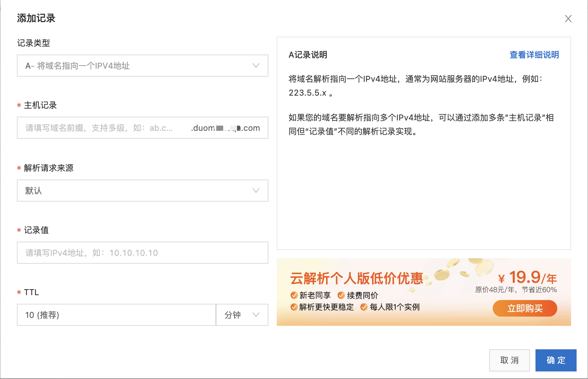
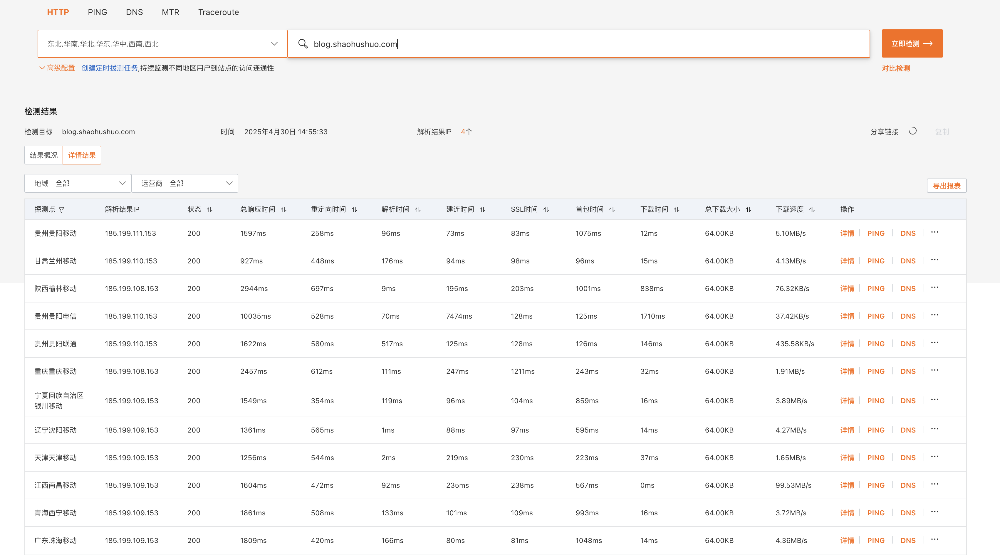

## 概述

按前面的步骤，所有服务迁移完毕之后，最后就剩下 DNS 解析修改了。

## 修改解析



在域名解析处，修改域名的解析地址即可。

如果 IP 已经过户到了新账号，则不需要修改解析。

## 何确保业务稳定

域名解析更换时，由于 DSN 解析存在缓存，各运营商的解析缓存刷新时间会有所不同，短则一两分钟，长则一两天。所以，为了确保业务稳定，可以采用以下两种方案。

### 双可用模式

原账号中的服务器仍然保持运行，数据库参考 [03.数据库迁移](./03-数据库迁移.md) 中的方案，使用双向同步。

这样，如果存在部分流量指向旧的服务器，则仍然可用，直到所有流量都指向新的服务器再行关闭。

1. 使用 [网络拨测工具](https://boce.aliyun.com/detect/http) 检查 DNS 解析生效情况。



2. 通过查询原账号服务器中的 Nginx 等访问日志，检查是否仍有流量存在。

### 代理模式

在原服务器的网关入口处，通过搭建 Nginx 代理，将流程转发至新的服务器。

```bash
  location / {
    proxy_pass https://10.8.8.8/;
}
```

## 参考资料

- [网络拨测工具](https://boce.aliyun.com/detect/http)