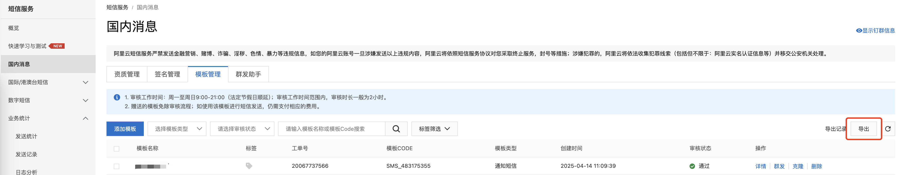

## 概述

当完成了服务器、数据库、IP、OSS等迁移后，剩下的就是其他服务了。

## 短信网关

短信模板只能一个个创建，不能批量操作。但是可以使用以下方式优化操作。

1. 在原账号导出模板列表

2. 考虑通过调用 API 来创建模板

通过脚本读取导出的模板列表，然后调用 [申请短信模板API](https://api.aliyun.com/document/Dysmsapi/2017-05-25/CreateSmsTemplate) 来创建。

## Redis

Redis 同样可以使用 DTS 工具进行迁移，用法与[数据库迁移](./03-数据库迁移.md)类似，这里不再赘述。

同时 Redis 也可以使用 AOF 文件方式迁移，参考 [使用AOF文件进行迁移](https://help.aliyun.com/zh/redis/user-guide/use-aof-files-to-migrate-data) 进行操作。

## 其他

以下服务只能通过手动创建，无法直接迁移使用，如 短信推送、消息队列、内容安全、SSL证书、负载均衡、WAF、日志存储等。

## 参考资料

- [申请短信模板接口](https://api.aliyun.com/document/Dysmsapi/2017-05-25/CreateSmsTemplate)
- [使用AOF文件进行迁移](https://help.aliyun.com/zh/redis/user-guide/use-aof-files-to-migrate-data)